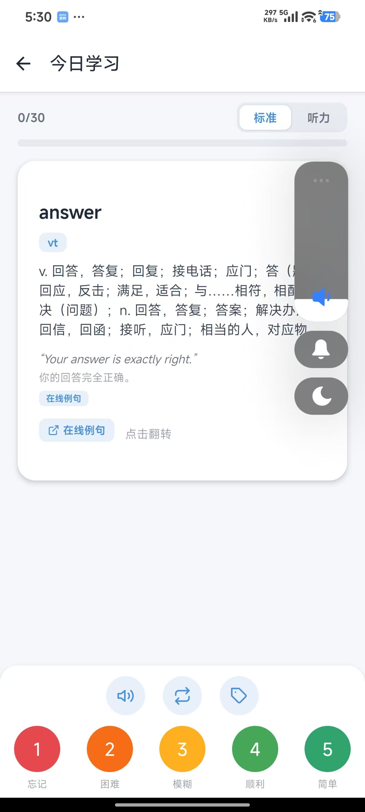
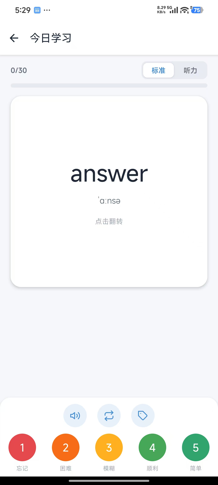

# VocabApp 背单词

基于 **React Native + Expo** 的单词学习应用，支持多词本学习、SM-2 间隔重复排程复习、词典原声发音与学习统计。

## 效果图





## 功能特性

- 多词本学习：CET-4（4537 词）/ CET-6（2165 词）/ IELTS（1319 词），词本可切换且选择持久化
- 每日学习 / 每日复习分离，各自独立配额，可自定义每日学习与复习量
- SM-2 间隔重复算法（ef / interval / repetitions / next_review）排程复习
- 3D 翻转复习卡片，左右滑评分（忘记 1 ~ 简单 5），会话内重试机制
- 困难词机制：连续失败 2 次自动标记困难词，每日优先出现在复习队列
- 词典原声发音：有道 / 百度双源下载 + 本地缓存 + 系统 TTS 兜底四级播放链
- 单词本：搜索、状态统计、每词发音、例句外链（有道移动版）
- 单词详情：标签云、熟悉度滑块、复习历史、进度重置
- 统计页：连续打卡、复习次数、正确率、90 天热力图、熟悉度分布环形图

## 技术栈

- Expo SDK 52 / React Native 0.76
- expo-sqlite（本地持久化）
- React Navigation（Stack 导航）
- Jest（单元测试）

## 快速开始

```bash
# 安装依赖
npm install

# 启动开发服务
npm start        # Expo 开发服务器

# 运行测试
npm test
```

## 项目结构

```
src/
├── components/    # 可复用组件（FlashCard、ProgressBar、TagManager 等）
├── context/       # 全局应用上下文
├── data/          # 词表数据（wordbooks/*.json）
├── navigation/    # 导航配置
├── screens/       # 页面（Home / Review / Stats / WordList / WordDetail）
├── services/      # 业务服务（VocabManager、SrsScheduler、TtsService 等）
└── utils/         # 工具函数
pages/             # 配套 HTML 页面
tools/             # 开发工具脚本（APK 构建、音频下载、TTS 服务等）
__tests__/         # Jest 单元测试
```

## 构建 APK

```powershell
npm run build:apk
```

详细开发指南见 [DEVELOPMENT.md](DEVELOPMENT.md)，踩坑经验与架构决策见 [EXPERIENCE_SUMMARY.md](EXPERIENCE_SUMMARY.md)。

## 许可证

本项目仅供学习交流使用。
