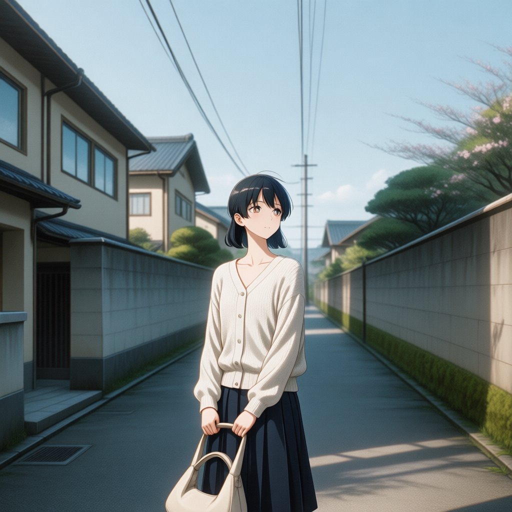

# ComfyUI 工作流介绍

本目录包含 3 个 ComfyUI 工作流（JSON 格式），覆盖文生图、写实转动漫、参考图生成视频三类场景。将 JSON 文件直接拖入 ComfyUI 画布，或通过 Workflow 导入菜单加载即可使用。

| 文件 | 类型 | 用途 |
| --- | --- | --- |
| `z-image.json` | 文生图 | z-image 模型写实人像/风景生成 |
| `real to anime.json` | 图生图风格迁移 | 写实图片转二次元动漫风格（两阶段） |
| `videoflow H3.json` | 视频生成 | MiniMax H3 参考图 + 提示词生成带音频的视频 |

---

## 1. z-image.json — z-image 文生图

### 用途

使用 z-image 底模进行文生图，输出写实风格图片，并叠加动漫高清放大 LoRA 提升画面细节。默认 512x512 出图，适合人像、风景等写实题材。

### 节点流程

UNETLoader（加载 `z_image_bf16.safetensors`）→ KSampler（euler / beta，22 步，cfg 8.2）→ VAEDecode → PreviewImage。文本编码由 CLIPLoader 加载的 `qwen_3_4b.safetensors` 提供，空 Latent 由 EmptyLatentImage（512x512）生成。

> 注：工作流中已配置 `Klein_动漫高清放大.safetensors` LoRA 节点（模型强度 0.53），当前保存状态下未接入模型主链路，需要时可将 UNETLoader 输出接入该节点再连回 KSampler。

### 关键参数

| 参数 | 值 |
| --- | --- |
| 尺寸 | 512 x 512 |
| 采样 | euler / beta，22 步，cfg 8.2，denoise 1.0 |
| 正向提示词 | 示例为银发少女写真人像（樱花、日式庭院），可替换 |
| 反向提示词 | 常规质量负向词（lowres、bad anatomy、watermark 等） |

### 依赖模型（放置目录）

| 模型 | 目录 |
| --- | --- |
| `z_image_bf16.safetensors` | models/checkpoints |
| `qwen_3_4b.safetensors` | models/clip |
| `ae.safetensors` | models/vae |
| `Klein_动漫高清放大.safetensors` | models/loras（可选） |

---

## 2. real to anime.json — 写实转动漫（两阶段）

### 用途

将写实图片转换为二次元动漫风格。工作流先通过 z-image-turbo 文生图生成写实底图，再以 Qwen Image Edit 模型 + anything2anime LoRA 进行低降噪图生图重绘，得到动漫化结果。内置王家卫风格电影感示例提示词。

### 效果展示

### 节点流程

两阶段串联：

- **阶段一（生成写实底图）**：CLIPLoader（`qwen_3_4b.safetensors`）编码提示词 → UNETLoader（`z_image_turbo_bf16.safetensors`）→ KSampler（euler / simple，20 步，cfg 8）→ VAEDecode → PreviewImage（1024x1024）
- **阶段二（转动漫重绘）**：PreviewImage 输出经 VAEEncode（`qwen_image_vae.safetensors`）编码为 Latent → GGUFLoaderKJ 加载量化版 `qwen-image-edit-2511-Q4_K_M.gguf` → LoraLoader 叠加 `anything2anime_QwenEdit_2511.safetensors`（强度 1.0）→ 触发词 `2anime` 编码 → KSampler（euler / simple，30 步，cfg 6，denoise 0.2）低降噪重绘 → VAEDecode → PreviewImage

### 关键参数

| 阶段 | 参数 | 值 |
| --- | --- | --- |
| 阶段一 | 尺寸 / 步数 / cfg | 1024 x 1024 / 20 / 8 |
| 阶段二 | 步数 / cfg / denoise | 30 / 6 / 0.2 |
| 触发词 | 正向文本 | `2anime`（转动漫风格关键字） |

### 依赖模型（放置目录）

| 模型 | 目录 |
| --- | --- |
| `z_image_turbo_bf16.safetensors` | models/checkpoints |
| `qwen_3_4b.safetensors` | models/clip |
| `qwen_2.5_vl_7b_fp8_scaled.safetensors` | models/clip |
| `ae.safetensors` | models/vae |
| `qwen_image_vae.safetensors` | models/vae |
| `qwen-image-edit-2511-Q4_K_M.gguf` | models/unet（GGUF 格式，需 comfyui-kjnodes 的 GGUFLoaderKJ 节点） |
| `anything2anime_QwenEdit_2511.safetensors` | models/loras |

---

## 3. videoflow H3.json — MiniMax H3 参考图视频生成

### 用途

以一张参考图 + 英文提示词生成短视频（含人物语音），输出 MP4。示例场景为缅甸城市屋顶上女子挥手说话，提示词内已写入台词（"We are in Myanmar."）。基于 MiniMax H3 视频模型，可同时生成画面与音轨。

### 效果展示

[示例视频（MP4）](examples/videoflow-h3-demo.mp4)

### 节点流程

LoadImage 加载参考图 → MiniMaxH3ReferenceToVideo（参考图 + 提示词 + 视频 VAE + 音频 VAE）输出条件与初始 Latent → RandomNoise + BasicGuider + KSamplerSelect（res_multistep）+ BasicScheduler（simple，20 步）→ SamplerCustomAdvanced 采样 → VAEDecode 出画面、VAEDecodeAudio 出音频 → CreateVideo（30 fps）合成 → SaveVideo 保存 MP4 到 `video/ComfyUI`。

### 关键参数

| 参数 | 值 |
| --- | --- |
| 分辨率 / 帧数 | 832 x 480 / 124 帧 |
| 帧率 / 输出格式 | 30 fps / mp4 |
| 采样 | res_multistep / simple，20 步，denoise 1.0 |
| 参考图 | 本地图片（LoadImage 节点选择） |
| 提示词 | 英文提示词（PrimitiveStringMultiline 节点编辑，含台词） |

### 依赖模型（放置目录）

| 模型 | 目录 |
| --- | --- |
| `minimax_h3_fl2va_pruned_int8_convrot.safetensors` | models/checkpoints |
| `qwen3vl_32b_minimax_h3_nvfp4_awq.safetensors` | models/clip |
| `minimax_h3_video_vae_fp16.safetensors` | models/vae |
| `minimax_h3_audio_vae_fp32.safetensors` | models/vae |

> 提示：该工作流依赖较新的 ComfyUI 核心节点（MiniMaxH3ReferenceToVideo、SamplerCustomAdvanced、CreateVideo、SaveVideo），请确保 ComfyUI 版本支持，且显存充足。

---

## 使用步骤

1. 将目标 JSON 文件拖入 ComfyUI 画布加载；
2. 确认本地已放置上表所列模型（对应 models 子目录）；
3. 编辑提示词（real to anime 中文 / z-image 英文 / videoflow H3 英文）与尺寸等参数；
4. 点击 Queue Prompt 运行，结果在 PreviewImage 预览，视频自动保存到 `output/video/ComfyUI`。

## 注意事项

- 模型文件体积较大（z-image、MiniMax H3 系列为 GB 级），未包含在本仓库中，需单独下载放置；
- `real to anime.json` 的 GGUFLoaderKJ 节点来自 comfyui-kjnodes 自定义节点包，缺失时需先安装；
- 视频生成（videoflow H3）对显存要求较高，建议在独立显卡 16GB 以上环境运行。
